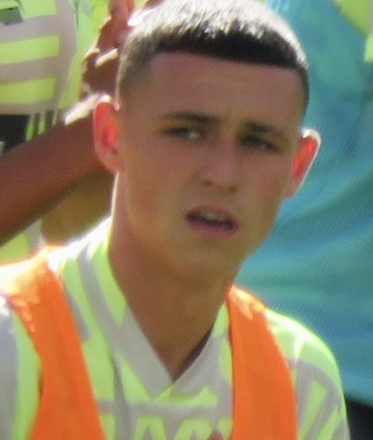

# Team Man City - Claude Code Agent Squad

<div align="center">


### BMAD + SDD Methodology Agent Team

**Manchester City 2024-25 Squad** 테마의 Claude Code 에이전트 팀 플러그인

*"Together we are stronger"*

[](LICENSE)
[](https://claude.com/claude-code)

</div>

---

## Overview

맨체스터 시티 선수들의 페르소나를 입힌 **8명의 Claude Code 에이전트 팀** 플러그인입니다.

- **BMAD** (Build, Measure, Analyze, Deploy) 방법론 기반 워크플로우
- **SDD** (Spec-Driven Development) 3-Phase 개발 프로세스
- **유교적 상하관계** - 나이 기반 존댓말/반말 커뮤니케이션
- **Agent Teams** 실험 기능을 활용한 멀티 에이전트 협업

## The Squad

<table>
<tr>
<td align="center" width="25%">
<br>
<b>Kevin De Bruyne</b><br>
<sub>Team Lead / Chief Engineer</sub><br>
<sub>35세 | #17 | opus</sub><br>
<a href="agents/team-lead.md">team-lead.md</a>
</td>
<td align="center" width="25%">
<br>
<b>Kyle Walker</b><br>
<sub>PM / Analyst</sub><br>
<sub>36세 | #2 | opus</sub><br>
<a href="agents/pm-analyst.md">pm-analyst.md</a>
</td>
<td align="center" width="25%">
<br>
<b>Bernardo Silva (C)</b><br>
<sub>Principal Architect</sub><br>
<sub>32세 | #20 | opus</sub><br>
<a href="agents/architect.md">architect.md</a>
</td>
<td align="center" width="25%">
<br>
<b>Rodri</b><br>
<sub>Code Reviewer / Principal Engineer</sub><br>
<sub>30세 | #16 | opus</sub><br>
<a href="agents/code-reviewer.md">code-reviewer.md</a>
</td>
</tr>
<tr>
<td align="center" width="25%">
<br>
<b>Ederson</b><br>
<sub>Security Reviewer</sub><br>
<sub>33세 | #31 | opus</sub><br>
<a href="agents/security-reviewer.md">security-reviewer.md</a>
</td>
<td align="center" width="25%">
<br>
<b>John Stones</b><br>
<sub>QA Engineer</sub><br>
<sub>32세 | #5 | sonnet</sub><br>
<a href="agents/qa-engineer.md">qa-engineer.md</a>
</td>
<td align="center" width="25%">
<br>
<b>Erling Haaland</b><br>
<sub>Backend Developer</sub><br>
<sub>26세 | #9 | sonnet</sub><br>
<a href="agents/backend-developer.md">backend-developer.md</a>
</td>
<td align="center" width="25%">
<br>
<b>Phil Foden</b><br>
<sub>Frontend Developer</sub><br>
<sub>26세 | #47 | sonnet</sub><br>
<a href="agents/frontend-developer.md">frontend-developer.md</a>
</td>
</tr>
</table>

---

## Prerequisites

- [Claude Code](https://docs.anthropic.com/en/docs/claude-code) CLI 설치 필요
- Claude Pro / Max / Team / Enterprise 플랜

```bash
npm install -g @anthropic-ai/claude-code
```

## Installation

### Quick Install (Recommended)

```bash
git clone https://github.com/jh941213/team-mancity-claude-code.git
cd team-mancity-claude-code
./install.sh
```

설치 스크립트가 자동으로:
1. `~/.claude/agents/`에 8개 에이전트 파일 배치
2. `~/.claude/settings.json`에 Agent Teams 실험 기능 활성화
3. `teammateMode` 설정

### Manual Install

#### Step 1: 에이전트 파일 복사

```bash
git clone https://github.com/jh941213/team-mancity-claude-code.git
mkdir -p ~/.claude/agents
cp team-mancity-claude-code/agents/*.md ~/.claude/agents/
```

#### Step 2: Agent Teams 실험 기능 활성화

`~/.claude/settings.json` 파일을 열고 다음을 추가합니다:

```json
{
  "env": {
    "CLAUDE_CODE_EXPERIMENTAL_AGENT_TEAMS": "1"
  },
  "teammateMode": "in-process"
}
```

> **이미 settings.json이 있는 경우**, 기존 설정에 `env`와 `teammateMode`를 머지하세요:
>
> ```json
> {
>   "env": {
>     "CLAUDE_CODE_EXPERIMENTAL_AGENT_TEAMS": "1",
>     "기존_환경변수": "값"
>   },
>   "teammateMode": "in-process",
>   "기존_설정": "값"
> }
> ```

#### Step 3: 설치 확인

```bash
# Claude Code 실행
claude

# 에이전트 목록 확인 - /agents 명령어로 확인 가능
```

### Uninstall

```bash
cd team-mancity-claude-code
./uninstall.sh
```

---

## Settings 상세 설명

### 핵심 설정

`~/.claude/settings.json`:

```json
{
  "env": {
    "CLAUDE_CODE_EXPERIMENTAL_AGENT_TEAMS": "1"
  },
  "teammateMode": "in-process"
}
```

| 설정 | 값 | 설명 |
|------|---|------|
| `CLAUDE_CODE_EXPERIMENTAL_AGENT_TEAMS` | `"1"` | Agent Teams 실험 기능 ON/OFF. 활성화 시 `TeamCreate`, `SendMessage`, `TaskCreate` 등 팀 협업 도구 사용 가능 |
| `teammateMode` | `"in-process"` | 팀원 에이전트의 표시 모드 (아래 참고) |

### Display Mode: 팀원을 어떻게 볼 것인가

#### 1. In-Process (기본값) - 모든 터미널 OK

```
┌──────────────────────────────────┐
│  하나의 터미널 창                    │
│                                  │
│  현재: De Bruyne (team-lead)      │
│  > 작업 계획을 세우고 있습니다...     │
│                                  │
│  Shift+Up/Down → 다른 팀원 전환     │
│  Enter → 해당 팀원 세션 보기         │
│  Escape → 인터럽트                  │
└──────────────────────────────────┘
```

- 한 화면에서 팀원을 **키보드로 전환**하며 봄
- Terminal.app, VS Code 터미널 등 **어디서든 동작**
- 설정: `"teammateMode": "in-process"`
- 또는 실행 시: `claude --teammate-mode in-process`

#### 2. Split Panes - iTerm2 또는 tmux 필요

```
┌────────────────┬────────────────┐
│ De Bruyne(리드)  │ Walker(PM)      │
│ > 작업 배분중... │ > PRD 작성중...  │
├────────────────┼────────────────┤
│ Haaland(백엔드)  │ Foden(프론트)    │
│ > API 구현중...  │ > UI 구현중...   │
└────────────────┴────────────────┘
```

- 각 팀원이 **자기만의 터미널 패널**에서 동시에 보임
- 모든 팀원의 작업 상황을 **실시간으로 한눈에** 확인 가능
- **iTerm2** 또는 **tmux** 필수

> **주의**: VS Code 통합 터미널, Windows Terminal, Ghostty에서는 Split Panes가 동작하지 않습니다.

### Split Panes 세팅 가이드

#### Option A: iTerm2 (macOS 권장)

```bash
# 1. iTerm2 설치
brew install --cask iterm2

# 2. iTerm2 실행 후 Claude Code 시작
claude
```

별도 설정 불필요. iTerm2가 split pane을 네이티브로 지원합니다.

#### Option B: tmux (모든 OS)

```bash
# 1. tmux 설치
brew install tmux          # macOS
sudo apt install tmux      # Ubuntu/Debian

# 2. tmux 세션 시작
tmux new -s mancity

# 3. tmux 안에서 Claude Code 실행
claude
```

팀이 생성되면 자동으로 tmux 패널이 분할됩니다.

**tmux 기본 키 조작:**

| 키 | 동작 |
|----|------|
| `Ctrl+B` → `"` | 수평 분할 |
| `Ctrl+B` → `%` | 수직 분할 |
| `Ctrl+B` → 방향키 | 패널 이동 |
| `Ctrl+B` → `z` | 현재 패널 줌 토글 |
| `Ctrl+B` → `d` | 세션 분리 (백그라운드) |

**팀 종료 후 tmux 정리:**

```bash
# 세션 확인
tmux ls

# 세션 종료
tmux kill-session -t mancity
```

### Display Mode 비교

| | In-Process | Split Panes |
|---|:---:|:---:|
| **터미널 요구사항** | 아무거나 OK | iTerm2 / tmux |
| **팀원 동시 확인** | 하나씩 전환 | 전부 동시에 |
| **VS Code 터미널** | OK | X |
| **설정 난이도** | 없음 | tmux 기본 지식 필요 |
| **추천 상황** | 일반 작업 | 팀원 3명+ 동시 모니터링 |

---

## Usage

### 개별 에이전트 사용

Claude Code에서 에이전트를 직접 호출:

```
"team-lead 에이전트로 이 기능의 작업 계획을 세워줘"
"architect 에이전트로 시스템 아키텍처를 설계해줘"
"backend-developer로 FastAPI 엔드포인트를 구현해줘"
"frontend-developer로 React 컴포넌트를 만들어줘"
"qa-engineer로 테스트 코드를 작성해줘"
"code-reviewer로 코드 리뷰해줘"
"security-reviewer로 보안 검토해줘"
```

### 팀 모드 사용 (Agent Teams)

풀 스쿼드를 팀으로 운영:

```
"TeamCreate로 'mancity-squad' 팀을 만들고,
Walker(pm-analyst)에게 요구사항 분석을,
Bernardo(architect)에게 설계를 맡기고,
Haaland(backend-developer)와 Foden(frontend-developer)이
병렬로 개발하게 해줘"
```

### SDD 워크플로우

```
Phase 1: Planning
  Walker(PM) --> Bernardo(Architect) --> De Bruyne(Approval)
      |              |                      |
   PRD 작성      아키텍처 설계         Spec/Design Gate

Phase 2: Development (Parallel)
  Haaland(Backend) <-----> Foden(Frontend)
      |                        |
   API/DB 구현            UI/UX 구현

Phase 3: Verification
  Stones(QA) --> Rodri(Review) --> Ederson(Security)
      |              |                  |
   테스트 작성     코드 리뷰         보안 검토
```

---

## Agent Details

| Agent File | Player | Role | Model | Tools |
|-----------|--------|------|-------|-------|
| `team-lead.md` | De Bruyne | BMAD Master Orchestrator | opus | Read, Grep, Glob |
| `pm-analyst.md` | Walker | PM / Requirements Analyst | opus | Read, Grep, Glob |
| `architect.md` | Bernardo Silva | System Architect | opus | Read, Grep, Glob, WebSearch |
| `backend-developer.md` | Haaland | Python/FastAPI Backend | sonnet | Read, Write, Edit, Glob, Grep, Bash |
| `frontend-developer.md` | Foden | React/TypeScript Frontend | sonnet | Read, Write, Edit, Glob, Grep, Bash |
| `qa-engineer.md` | Stones | QA + TDD Guide | sonnet | Read, Write, Edit, Glob, Grep, Bash |
| `code-reviewer.md` | Rodri | Code Quality Reviewer | opus | Read, Grep, Glob, Bash |
| `security-reviewer.md` | Ederson | Security Analyst | opus | Read, Grep, Glob, Bash |

## Hierarchy (Age-based)

에이전트 간 커뮤니케이션은 **나이 기반 유교적 상하관계**를 따릅니다:

| 순위 | 선수 | 나이 | 직급 | 말투 |
|:---:|------|:---:|------|------|
| 1 | Kyle Walker | 36 | Senior PM | 팀 최고참, 모두에게 반말 |
| 2 | Kevin De Bruyne | 35 | Chief Engineer | Walker에게만 형 대우, 나머지 반말 |
| 3 | Ederson | 33 | Senior Security | 후배들에게 반말 |
| 4 | Bernardo Silva | 32 | Principal Architect | 캡틴, 후배들에게 반말 |
| 4 | John Stones | 32 | Senior QA | 동갑 Bernardo와 편한 관계 |
| 6 | Rodri | 30 | Principal Engineer | 형들에게 존댓말, 막내들에게 반말 |
| 7 | Erling Haaland | 26 | Senior Developer | 막내, 형들에게 존댓말 |
| 7 | Phil Foden | 26 | Senior Developer | 막내, 형들에게 존댓말 |

---

## Customization

### 에이전트 수정

`~/.claude/agents/` 디렉토리의 `.md` 파일을 직접 수정하면 됩니다.

```yaml
---
name: team-lead           # 에이전트 호출 이름
description: ...          # 에이전트 설명
tools: Read, Grep, Glob   # 사용 가능한 도구
model: opus               # 사용할 모델 (opus / sonnet / haiku)
---
```

### 모델 변경

비용 절감을 위해 모델을 변경할 수 있습니다:

| 모델 | 특징 | 추천 용도 |
|------|------|----------|
| `opus` | 최고 성능, 높은 비용 | 설계, 리뷰, 의사결정 |
| `sonnet` | 균형잡힌 성능 | 코드 구현, 테스트 |
| `haiku` | 빠르고 저렴 | 간단한 작업, 검색 |

## Project Structure

```
team-mancity-claude-code/
├── README.md
├── install.sh          # 자동 설치 스크립트
├── uninstall.sh        # 제거 스크립트
├── agents/             # 에이전트 정의 파일
│   ├── team-lead.md           # De Bruyne - 팀 리드
│   ├── pm-analyst.md          # Walker - PM/기획자
│   ├── architect.md           # Bernardo - 아키텍트
│   ├── backend-developer.md   # Haaland - 백엔드
│   ├── frontend-developer.md  # Foden - 프론트엔드
│   ├── qa-engineer.md         # Stones - QA
│   ├── code-reviewer.md       # Rodri - 코드 리뷰
│   └── security-reviewer.md   # Ederson - 보안
└── images/             # 선수 이미지 (Wikimedia CC)
    ├── mancity-logo.svg
    ├── debruyne.jpg
    ├── walker.jpg
    ├── bernardo.jpg
    ├── haaland.jpg
    ├── foden.jpeg
    ├── stones.jpg
    ├── rodri.jpg
    └── ederson.jpg
```

## Image Credits

All player photos are from [Wikimedia Commons](https://commons.wikimedia.org/) under Creative Commons licenses (CC BY-SA 3.0 / 4.0).

## License

MIT

---

<div align="center">

*Built with [Claude Code](https://claude.com/claude-code)*

**CITYZENS** ⚽

</div>
